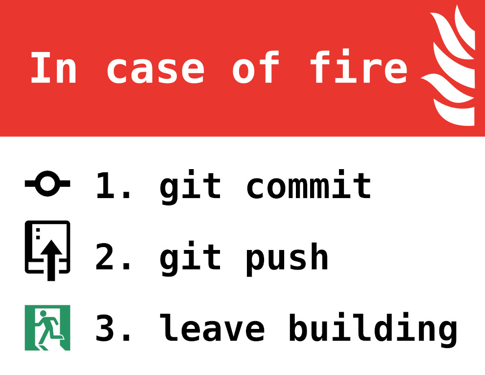
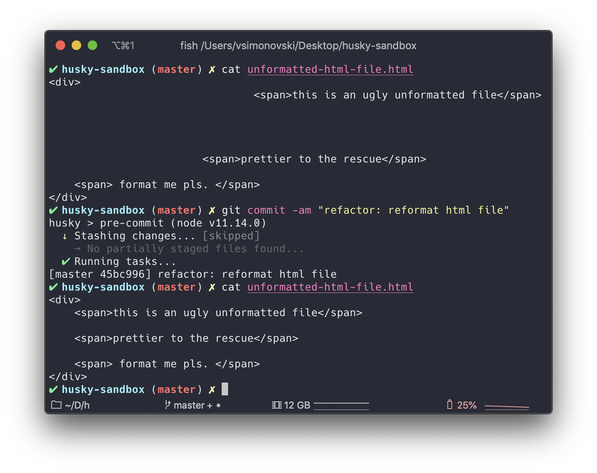
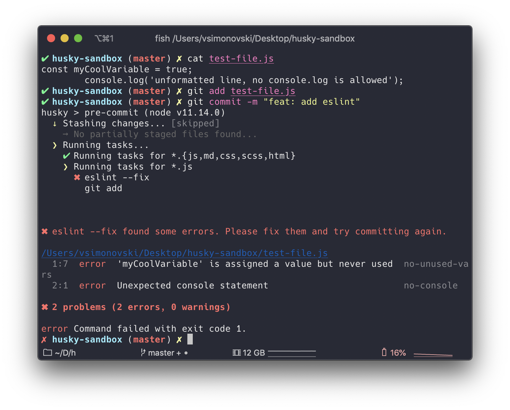
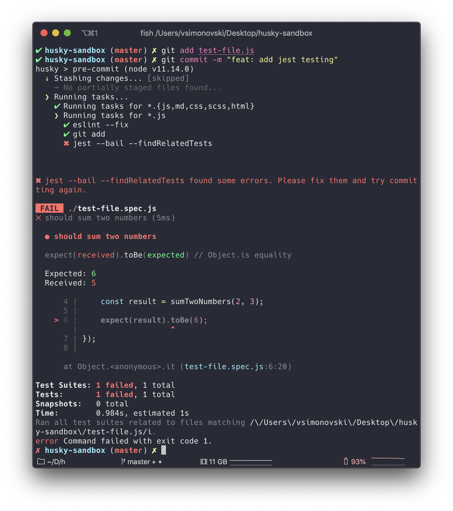
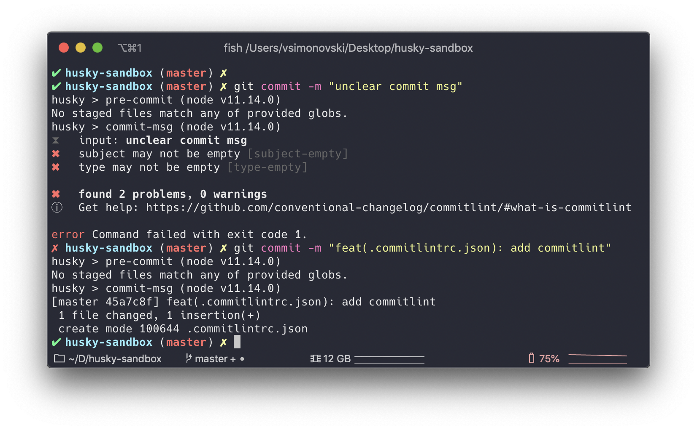

If you're like me, you're crazy over automating boring stuff. One of the things I got hooked on (pun intended) during the last year, and which helps in that automation process, is Git Hooks. If you haven't heard of Git Hooks and want to see some cool ways of improving your daily git workflow stay tuned!



## What are Git Hooks? 🎣

[This page](https://git-scm.com/book/en/v2/Customizing-Git-Git-Hooks) from Git documentation sums it up pretty well but in general Git Hooks are Gits answer on firing custom event when some Git related action occurs. We will focus on client-side `pre-commit` and `commit-msg` hooks today but following options are available:

- Client-Side Hooks

  - `pre-commit` - runs before we even type the commit message.
  - `prepare-commit-msg` - runs before the commit message editor is opened up but after the default message is created.
  - `commit-msg` - good place to validate project state or the commit message before allowing commit to proceed further.
  - `post-commit` - runs after the entire commit process is completed, used mostly for notifications.
  - `pre-rebase` - runs before the rebase.
  - `post-merge` - runs after the successful merge.
  - `pre-push` - runs during the Git push.
  - `pre-auto-gc` - runs before Git triggers a garbage collector.

- Server-Side Hooks
  - `pre-receive`- the first script that is run on the client-side push, if it exits non-zero,the push is not accepted.
  - `update` - pretty similar to the `pre-receive` excepts it runs once for every branch that the client-side wants to update. For example, if we're pushing to five branches at the same time, `pre-receive` will run once, `update` will run five times.
  - `post-receive` - similar to the client-side `post-commit` just on the server-side.

## Talk is cheap, show me the code

Since Git hooks don't have the best out of the box experience, we'll use the [Husky](https://github.com/typicode/husky) library to make stuff easier:

```bash{promptUser:$}
yarn add husky -D
```

You're now able to include hook definition inside `package.json` like this:

```json
// package.json
{
  // ...
  "husky": {
    "pre-commit": "<cool-script>",
    "commit-msg": "<even-cooler-script>"
  }
  // ...
}
```

## pre-commit

In most of cases we want to run the `pre-commit` hook only on staged files, [lint-staged](https://github.com/okonet/lint-staged) library helps us with that:

```bash{promptUser: vsimonovski}
yarn add lint-staged -D
```

After we've added the `lint-staged` we're able to do something like this inside a `package.json`:

```json{5,8-13}
// package.json
{
  "husky": {
    "hooks": {
      "pre-commit": "lint-staged"
    }
  },
  "lint-staged": {
    "*.{js,md,css,scss,html}": [
      "<yet-another-cool-command-1>",
      "<yet-another-cool-command-2>"
    ]
  }
}
```

Now when we know the basics, it's time to start adding scripts that will help our repository become better place ✨.

First let's add [prettier](https://prettier.io/) - hope you've heard of it since it's the best thing that happened to code formatting in a while.

```bash{promptUser:$}
yarn add prettier -D
```

We can pass arguments to the prettier script directly but I'm fan of config files, so we'll create a `.prettierrc` file in the project root directory:

```json
// .prettierrc
{
  "singleQuote": true,
  "tabWidth": 2,
  "trailingComma": "es5"
  // other available options: https://prettier.io/docs/en/options.html
}
```

Prettier will format all staged files on the commit so they follow a code convention defined inside the `.prettierrc`.

```json
// package.json
{
  // ...
  "lint-staged": {
    "*.{js,md,css,scss,html}": ["prettier --write", "git add"]
  }
}
```



Time to lint our `.js` files, we can easily do that with [eslint](https://github.com/eslint/eslint).

```bash{promptUser:$}
yarn add eslint -D
```

We will define a config file again, this time the `eslintrc.json`:

```json
// eslintrc.json
{
  "extends": "eslint:recommended",
  "env": {
    "browser": true,
    "commonjs": true,
    "node": true,
    "es6": true
  },
  "parserOptions": {
    "ecmaVersion": 2018
  },
  "rules": {
    "no-console": 2, // using console.log() throws error
    "curly": "warn" // enforce usage of curly braces, if(foo) foo++ will throw warning
  }
}
```

We need to define a special rule that will be triggered for `.js` files only. `eslint` will prevent committing if error is thrown.

```json{6}
// package.json
{
  // ...
  "lint-staged": {
    "*.{js,md,css,scss,html}": ["prettier --write", "git add"],
    "*.js": ["eslint --fix", "git add"]
  }
}
```



As the final step I'll show you how to run relevant unit tests (relevant to committed files) and prevent commit if some of them are failing.

```bash{promptUser: $}
yarn add jest -D
yarn add eslint-plugin-jest -D
```

We should add previously installed jest plugin to our eslint config file so we eliminate eslint errors on `.spec.js` files.

```json{3, 17}
// eslintrc.json
{
  "extends": ["eslint:recommended", "plugin:jest/recommended"],
  "env": {
    "browser": true,
    "commonjs": true,
    "node": true,
    "es6": true
  },
  "parserOptions": {
    "ecmaVersion": 2018
  },
  "rules": {
    "no-console": 2,
    "curly": "warn"
  },
  "plugins": ["jest"]
}
```

Now extend `lint-staged` script:

```json{6}
// package.json
{
  // ...
  "lint-staged": {
    "*.{js,md,css,scss,html}": ["prettier --write", "git add"],
    "*.js": ["eslint --fix", "git add", "jest --bail --findRelatedTests"]
  }
}
```

`--bail` will skip execution of other tests when first test fails and `--findRelatedTests` is pretty self-explanatory 😁.

To demonstrate how this works we can create two files `test-file.js` and `test-file.spec.js`

```js
// test-file.js
function sumTwoNumbers(a, b) {
  return a + b
}

module.exports = sumTwoNumbers
```

We're intentionally making the unit test fail so we can see commit failing:

```js
// test-file.spec.js
const sumTwoNumbers = require('./test-file')

it('should sum two numbers incorrectly', () => {
  const result = sumTwoNumbers(2, 3)

  expect(result).toBe(6)
})
```



## commit-msg

> There are only two hard things in Computer Science: cache invalidation and naming things

This rule applies to commit messages also, we've all seen or written commits like this in past:

```bash{promptUser:$}
git log --oneline

7c1f5c5 final fix
93393a0 aaaaa
3626b1d TEST WIP
45bc996 small css fix
29b2993 css final final fix
a2f6e18 lol
3ae828c UNIT TESTS ADDED WOO
```

This is an extreme example but it perfectly shows how we can't make a clear conclusion about what is going on in a particular commit.

If we check history of commit messages created during previous examples:

```bash{promptUser:$}
git log --oneline

2c1f5c5 feat: add jest testing
85bc9g6 refactor: reformat html file
```

Much cleaner right? This commits follow [Conventional Commit](https://www.conventionalcommits.org/en/v1.0.0/) convention created by [Angular team](https://github.com/angular/angular/blob/master/CONTRIBUTING.md#commit).

In general the pattern that commit message should follow mostly look like this:

```bash
type(scope?): subject  #scope is optional
```

Some of common types are:

- `feat` - commit adds a new feature.
- `fix` - commit fixes a bug.
- `docs` - commit introduces documentation changes.
- `style` - commit introduces code style change (indentation, format, etc.).
- `refactor` - commit introduces code refactoring.
- `perf` - commit introduces code performances.
- `test` - commit adds test to an existing feature.
- `chore` - commit updates something without impacting the user (ex: bump a dependency in package.json)

---

So, now when we know this, it's perfect time to introduce `commit-msg` hook where we'll check if commit message respect this rules before we commit.

First we want to install [commitlint](https://github.com/conventional-changelog/commitlint), something like eslint just for commit messages.

```bash{userPrompt:$}
# install commitlint cli and conventional config
yarn add -D @commitlint/{config-conventional,cli}
```

Of course we need to create another config file, `.commitlintrc.json`, the last one I promise! 🤞

```json
// .commitlintrc.json
{
  // Extend previously installed config
  "extends": ["@commitlint/config-conventional"]
}
```

Now we can extend hooks property inside the `package.json`:

```json{6}
// package.json
    // ...
    "husky": {
        "hooks": {
            "pre-commit": "lint-staged",
            "commit-msg": "commitlint -E HUSKY_GIT_PARAMS"
        }
    }
    // ...
```



---

Quick recap of what we learned today:

`lint-staged` inside the `pre-commit` hook will take care of:

- formatting all staged files via Prettier.
- check all staged `.js` files for syntax errors via Eslint
- check if relevant `.spec.js` unit test files are failing before we commit via Jest

`commitlint` inside the `commit-msg` hook will take care of:

- enforce commit message to follow Conventional Commit rules via Commitlint.

---

## See also

- [cz-cli](https://github.com/commitizen/cz-cli) - The commitizen command line utility.
- [husky-sandbox](https://github.com/vsimonovski/husky-sandbox) - Code samples from this post.
